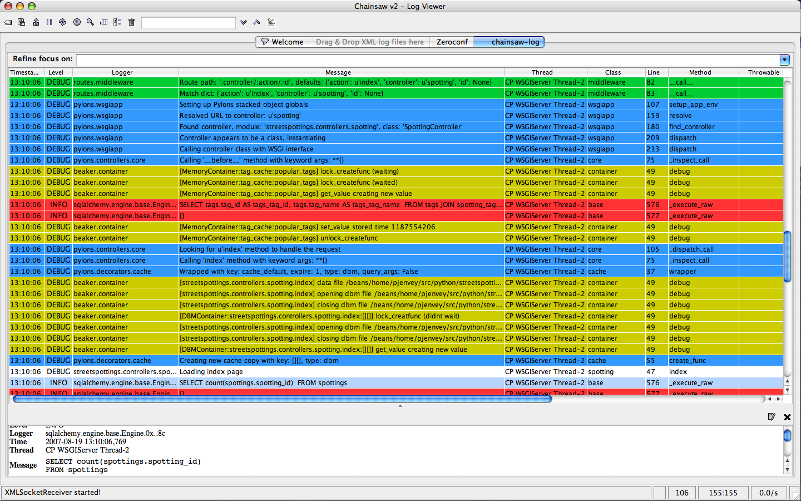

:Date: 2008-05-01
:Version: 1
:Review: 
:Authors: - Ben Bangert

.. sectionauthor:: Ben Bangert

.. _configuration:

=============
Configuration
=============

Introduction 
============ 

Pylons comes with two main ways to configure an application:

* Through the application's ``config`` directory 
* Through a user configuration file 

Typically as a developer writing a Pylons application you will change the files in the ``config`` directory to change certain aspects of how your application behaves but any options you want the webmaster using your configuration file to be able to configure will be specified by the in a configuration file. This document describes how to use the webmaster configurable configuration file support in Pylons. 

XXX: Write overview of configuration choices, difference between run-time/deplyment configuration, and application configuration (whats in the config/ dir)

.. _run-config:

Runtime Configuration
=====================

Default Configuration File Setup 
-------------------------------- 

When you create a project using ``paster create -t pylons`` a sample configuration file called ``development.ini`` is automatically produced as one of the project files. This is an example of a configuration file and contains sensible options for development use in your project. For example when you are developing a Pylons application it is very useful to be able to see a debug report every time an error occurs so the development.ini file includes options to enable debug mode so these errors are shown. 

You can serve your application using this development configuration like this: 

.. code-block :: bash 

    $ paster serve --reload development.ini 

The ``--reload`` option is useful during development as the server will automatically reload each time a file is changed so that you can test the changes without having to manually restart the server. 

Say your application is called wiki, when a user comes to want to setup an application they will run the command: 

.. code-block :: bash 

    $ paster make-config wiki production.ini 

This command produces a different configuration file with sensible options for production use. In particular, the debug display is disables as the report might contain your usernames, passwords or other information you wouldn't want end users to see. 

You can find out how to control what is produced by the ``paster make-config`` by reading `Application Setup <Packaging+and+Deployment>`_. 

It is your responsibility as a developer to ensure that a sensible set of default configuration values exist when the webmaster uses the ``paster make-config`` command. 

You can create as many different configuration files as you like. Typically a developer might have a ``development.ini`` configuration file for testing, a ``production.ini`` file produced by the ``paster make-config`` command for testing the command produces sensible production output. You might also want a ``testing.ini`` configuration for doing some specific testing or any other number of configurations appropriate for your application. You can deploy your configuration in a variety of ways supported by paste deploy but typically you would serve your configuration like this: 

.. code-block :: bash 

    $ paster serve production.ini 

Configuration File Format 
------------------------- 

Configuration file format is described in great detail in the `Paste Deploy documentation <http://www.pythonpaste.org>`_. 

Error Handling Options 
====================== 

A number of error handling options can be specified in the config file. These are described in the `Error Handler <interactive_debugger.txt>`_ documentation but the important point to remember is that debug should always be set to ``false`` in production environments otherwise if an error occurs the visitor will be presented with the developer's interactive traceback which they could use to execute malicious code.

.. _interactive_debugging:

Interactive debugging
---------------------

Things break, and when they do, quickly pinpointing what went wrong and why makes a huge difference. By default, Pylons uses a customized version of `Ian Bicking's <http://blog.ianbicking.org/>`_ EvalException middleware that also includes full Mako/Myghty Traceback information. 

See the Enabling Debugging section of the `Getting Started <Getting+Started>`_ guide to enable the interactive debugging. 

The Debugging Screen 
-------------------- 

The debugging screen has three tabs at the top: 

``Traceback`` 
Provides the raw exception trace with the interactive debugger 

``Extra Data`` 
Displays CGI, WSGI variables at the time of the exception, in addition to configuration information 

``Template`` 
Human friendly traceback for Mako or Myghty templates 

Since Mako and Myghty compile their templates to Python modules, it can be difficult to accurately figure out what line of the template resulted in the error. The `Template` tab provides the full Mako or Myghty traceback which contains accurate line numbers for your templates, and where the error originated from. If your exception was triggered before a template was rendered, no Template information will be available in this section. 

Example: Exploring the Traceback 
-------------------------------- 

Using the interactive debugger can also be useful to gain a deeper insight into objects present only during the web request like the ``session`` and ``request`` objects. 

To trigger an error so that we can explore what's happening just raise an exception inside an action you're curious about. In this example, we'll raise an error in the action that's used to display the page you're reading this on. Here's what the docs controller looks like: 

.. code-block:: python 

    class DocsController(BaseController): 
        def view(self, url): 
            if request.path_info.endswith('docs'): 
                redirect_to('/docs/') 
            return render('/docs/' + url) 

Since we want to explore the ``session`` and ``request``, we'll need to bind them first. Here's what our action now looks like with the binding and raising an exception: 

.. code-block:: python 

    def view(self, url): 
        raise "hi" 
        if request.path_info.endswith('docs'): 
            redirect_to('/docs/') 
        return render('/docs/' + url) 

Here's what exploring the Traceback from the above example looks like (Excerpt of the relevant portion): 

.. image:: _static/doctraceback.gif 

Email Options 
-------------

You can make all sorts of changes to how the debugging works. For example if you disable the ``debug`` variable in the config file Pylons will email you an error report instead of displaying it as long as you provide your email address at the top of the config file: 

.. code-block:: ini 

    error_email_from = you@example.com 

This is very useful for a production site. Emails are sent via SMTP so you need to specify a valid SMTP server too. 

Changing the Debugger Theme 
--------------------------- 

If you are using Pylons in a commercial company it is useful to be able to change the theme of the debugger so that if an error occurs, a page with your company logo appears. You might also decide to remove the Pylons logo if you use the debugger a lot so that there is more space to view the traceback. 

You can change the theme by creating a new template. For example, a very simple template might look like this: 

.. code-block:: python 

    my_error_template = ''' 
    <!DOCTYPE html PUBLIC "-//W3C//DTD XHTML 1.0 Strict//EN" 
    "http://www.w3.org/TR/xhtml1/DTD/xhtml1-strict.dtd"> 
    <html xmlns="http://www.w3.org/1999/xhtml" xml:lang="en" lang="en"> 
    <head> 
    <title>Server Error</title> 
    %(head)s 
    <body id="documentation"> 
    %(extra_data)s 
    %(template_data)s 
    %(traceback_data)s 
    </body> 
    </html> 
    ''' 

The values are automatically substituted by the error middleware. You can also add ``%(prefix)s`` which is replaced by the path to your application so you can include CSS files or images. For example if your application had a file called ``style.css`` in a directory called ``css`` within your ``public`` directory, you could add the following line to your template to ensure that the CSS file was always correctly found: 

.. code-block:: html 

    <link rel="stylesheet" href="%(prefix)s/css/style.css" type="text/css" media="screen" /> 

If you want to retain the ability to switch between the different error displays you need a slightly more complicated example: 

.. code-block:: python 

    my_error_template = ''' 
    <!DOCTYPE html PUBLIC "-//W3C//DTD XHTML 1.0 Strict//EN" 
    "http://www.w3.org/TR/xhtml1/DTD/xhtml1-strict.dtd"> 
    <html xmlns="http://www.w3.org/1999/xhtml" xml:lang="en" lang="en"> 
    <head> 
    <title>Server Error</title> 
    %(head)s 
    <body id="documentation" onload="switch_display('%(set_tab)s')"> 
    <ul id="navlist"> 
    <li id='traceback_data_tab' class="active"> 
    <a href="javascript:switch_display('traceback_data')" id='traceback_data_link'>Traceback</a> 
    </li> 
    <li id='extra_data_tab' class=""> 
    <a href="javascript:switch_display('extra_data')" id='extra_data_link'>Extra Data</a> 
    </li> 
    <li id='template_data_tab'> 
    <a href="javascript:switch_display('template_data')" id='template_data_link'>Template</a> 
    </li> 
    </ul> 
    
 
    %(extra_data)s 
    
 
    
 
    %(template_data)s 
    
 
    
 
    %(traceback_data)s 
    
 
    </body> 
    </html> 
    ''' 

In this case when you click on a link the relevant tab is displayed. As long as you keep the same IDs and class names, you can specify your own styles and create a theme like the one used by Pylons by default. 

Now that you have a template you need to use it in your application. In ``config/middleware.py`` change the following lines: 

.. code-block:: python 

    # Error Handling 
    app = ErrorHandler(app, 
            global_conf, error_template=error_template, **config.errorware) 

to use your template: 

.. code-block:: python 

    my_error_template = ''' 
    <!DOCTYPE html PUBLIC "-//W3C//DTD XHTML 1.0 Strict//EN" 
    "http://www.w3.org/TR/xhtml1/DTD/xhtml1-strict.dtd"> 
    <html xmlns="http://www.w3.org/1999/xhtml" xml:lang="en" lang="en"> 
        <head> 
            <title>Server Error</title> 
            %(head)s 
        <body id="documentation"> 
            %(extra_data)s 
            %(template_data)s 
            %(traceback_data)s 
        </body> 
    </html> 
    ''' 
    app = ErrorHandler(app, global_conf, 
            error_template=my_error_template, **config.errorware) 

Your interactive debugger will now be themed with the new template. 
 

Getting Information From Configuration Files 
============================================ 

All information from your configuration file is available in the ``pylons.config`` object. ``pylons.config`` also contains runtime configuration as defined in your project's ``config.environment`` module. 

.. code-block :: python 

    from pylons import config 

``pylons.config`` behaves like a dictionary. For example you can obtain the location of the cache directory like this: 

.. code-block :: python 

    cache_dir = config.get('cache_dir') 

Or the debug status like this: 

.. code-block :: python 

    debug = config.get('debug') 

XXX: Explain run-time config, the ini format used by development.ini and the
other ini files and how that affects the run-time configuration

.. _environment-config:

Environment
===========

The :file:`config/environment.py` module, sets up the basic Pylons environment
variables needed to run the application. Objects that should be setup once
for the entire application should either be setup here, or in the
:file:`lib/app_globals` :meth:`__init__.py` method.

It also calls the :ref:`url-config` function to setup how the URL's will
be matched up to your :ref:`controllers`, creates your :term:`app_globals`
object, configures which module will be referred to as :term:`h`, and is
where the template engine is setup.

If you're using SQLAlchemy, its recommended that you setup the SQLAlchemy
engine in this module. The default SQLAlchemy setup that Pylons comes with
creates the engine here which is then used in :file:`model/__init__.py`.

.. _url-config:

URL Configuration
=================

Routes handles mapping URLs to controllers and their methods, or their 
:term:`action` as Routes refers to them. By default, Pylons sets up the 
following :term:`route` (found in :file:`YOURPROJ/config/routing.py`):

.. code-block:: python

	map.connect(':controller/:action/:id')

A part of the path beginning with a ``:`` means that it is a variable 
that will match that part of the URL. The default mapping can match to 
any of your controllers, and any of their actions, which means the 
following URLs will match like so:

.. code-block:: text

	/entry/view/4      >>    controller: entry, action: view, id:4
	/comment/edit/2    >>    controller: comment, action: edit, id:2

Adding a route to match ``/``
-----------------------------

The controller and action can be specified directly in the :meth:`map.connect`
statement, as well as the raw URL you want to match.

Since the first ``/`` doesn't need to be in the route, adding the 
``/`` match looks like this:

.. code-block:: python

	map.connect('', controller='main', action='index')

Generating URLs
---------------

URLs can be generated using the helper method :meth:`url_for`, which by 
default in a Pylons project will be under the :data:`h` global variable.

Keyword arguments indicating the controller and action to use can be 
passed directly in:

.. code-block:: python
	
	# generates /content/view/2
	h.url_for(controller='content', action='view', id=2)  

Inside your templates, you might notice that other parts seem to creep into the
URLs generated. This is due to 
`Routes memory <http://routes.groovie.org/manual.html#route-memory>`_ and can be 
disabled by specifying the controller with a ``/`` in front like so:

.. code-block:: python

	# generates /content/view/2
	h.url_for(controller='/content', action='view', id=2)   

Keeping methods private
-----------------------

Since the default route will map any controller and action, you will probably 
want to prevent some methods in a controller from being callable from a URL.

Routes uses the default Python convention of private methods beginning with
``_``. To hide a method ``edit_generic`` in this class, just changing its name
to begin with ``_`` will be sufficient:

.. code-block:: python

	class UserController(BaseController):
		def index(self):
			return Response("This is the index.")
	
		def _edit_generic(self):
			"I can't be called from the web!"
			return True

.. seealso::

    `Routes manual <http://routes.groovie.org/manual.html>`_
    Full details and source code.

.. _middleware-config:

Middleware
==========

PrefixMiddleware 
---------------- 

``PrefixMiddleware`` provides a way to manually override the root prefix (``SCRIPT_NAME``) of your application for certain situations. 

When running an application under a prefix (such as '``/james``') in FastCGI/apache, the ``SCRIPT_NAME`` environment variable is automatically set to to the appropriate value: '``/james``'. Pylons' URL generating functions such as ``url_for`` always take the ``SCRIPT_NAME`` value into account. 

One situation where ``PrefixMiddleware`` is required is when an application is accessed via a reverse proxy with a prefix. The application is accessed through the reverse proxy via the the URL prefix '``/james``', whereas the reverse proxy forwards those requests to the application at the prefix '``/``'. 

The reverse proxy, being an entirely separate web server, has no way of specifying the ``SCRIPT_NAME`` variable; it must be manually set by a ``PrefixMiddleware`` instance. Without setting ``SCRIPT_NAME``, ``url_for`` will generate URLs such as: '``/purchase_orders/1``', when it should be generating: '``/james/purchase_orders/1``'. 

To filter your application through a ``PrefixMiddleware`` instance, add the following to the '``[app:main]``' section of your .ini file: 

.. code-block :: ini 

    filter-with = proxy-prefix 

    [filter:proxy-prefix] 
    use = egg:PasteDeploy#prefix 
    prefix = /james 

The name ``proxy-prefix`` simply acts as an identifier of the filter section; feel free to rename it. 

These .ini settings are equivalent to adding the following to the end of your application's ``config/middleware.py``, right before the ``return app`` line: 

.. code-block :: python 

    # This app is served behind a proxy via the following prefix (SCRIPT_NAME) 
    app = PrefixMiddleware(app, global_conf, prefix='/james') 

This requires the additional import line: 

.. code-block :: python 

    from paste.deploy.config import PrefixMiddleware 

Whereas the modification to ``config/middleware.py`` will setup an instance of ``PrefixMiddleware`` under every environment (.ini). 

XXX: How to change the middleware, the purpose of full_stack, changing when
middleware is used in the stack

.. _setup-config:

Application Setup
=================

XXX: Explain how to setup app dependencies in the setup.py file to ensure
the appropriate libraries are required, explain what setup.py needs, etc.

.. _logging:

Logging
=======

Logging messages 
----------------
 
As of Pylons 0.9.6, Pylons controllers (created via ``paster 
controller/restcontroller``) and ``websetup.py`` create their own Logger objects 
via `Python's logging module <http://docs.python.org/lib/module-logging.html>`_. 

For example, in the helloworld project's hello controller 
(``helloworld/controllers/hello.py``): 

.. code-block:: python 

    import logging 

    from helloworld.lib.base import * 

    log = logging.getLogger(__name__) 

    class HelloController(BaseController): 

        def index(self): 
            # Return a... 

Python's special ``__name__`` variable refers to the current module's fully 
qualified name; in this case, ``helloworld.controllers.hello``. 

To log messages, simply use methods available on that Logger object: 

.. code-block:: python 

    import logging 

    from helloworld.lib.base import * 

    log = logging.getLogger(__name__) 

    class HelloController(BaseController): 

        def index(self): 
            content_type = 'text/plain' 
            content = 'Hello World!' 

            log.debug('Returning: %s (content-type: %s)', content, content_type) 
            response.content_type = content_type 
            return content 

Which will result in the following printed to the console, on stderr: 

.. code-block:: text 

    16:20:20,440 DEBUG [helloworld.controllers.hello] Returning: Hello World! (content-type: text/plain) 

Basic Logging configuration 
---------------------------
 
As of Pylons 0.9.6, the default ini files include a basic configuration for the 
logging module. Paste ini files use the Python standard `ConfigParser format 
<http://docs.python.org/lib/module-ConfigParser.html>`_; the same format used 
for the Python `logging module's Configuration file format 
<http://docs.python.org/lib/logging-config-fileformat.html>`_. 

``paster``, when loading an application via the ``paster`` ``serve``, ``shell`` 
or ``setup-app`` commands, calls the `logging.fileConfig function 
<http://docs.python.org/lib/logging-config-api.html>`_ on that specified ini 
file if it contains a 'loggers' entry. ``logging.fileConfig`` reads the logging 
configuration from a ``ConfigParser`` file. 

Logging configuration is provided in both the default ``development.ini`` and 
the production ini file (created via ``paster make-config <package_name> 
<ini_file>``). The production ini's logging setup is a little simpler than the 
``development.ini``'s, and is as follows: 

.. code-block:: ini 

    # Logging configuration 
    [loggers] 
    keys = root 

    [handlers] 
    keys = console 

    [formatters] 
    keys = generic 

    [logger_root] 
    level = INFO 
    handlers = console 

    [handler_console] 
    class = StreamHandler 
    args = (sys.stderr,) 
    level = NOTSET 
    formatter = generic 

    [formatter_generic] 
    format = %(asctime)s %(levelname)-5.5s [%(name)s] %(message)s 

One root Logger is created that logs only messages at a level above or equal to 
the ``INFO`` level to stderr, with the following format: 

.. code-block:: text 

    2007-08-17 15:04:08,704 INFO [helloworld.controllers.hello] Loading resource, id: 86 

For those familiar with the ``logging.basicConfig`` function, this configuration 
is equivalent to the code: 

.. code-block:: python 

    logging.basicConfig(level=logging.INFO, 
    format='%(asctime)s %(levelname)-5.5s [%(name)s] %(message)s') 

The default ``development.ini``'s logging section has a couple of differences: 
it uses a less verbose timestamp, and defaults your application's log messages 
to the ``DEBUG`` level (described in the next section). 

Pylons and many other libraries (such as Beaker, SQLAlchemy, Paste) log a number 
of messages for debugging purposes. Switching the root Logger level to ``DEBUG`` 
reveals them: 

.. code-block:: ini 

    [logger_root] 
    #level = INFO 
    level = DEBUG 
    handlers = console 

Filtering log messages 
^^^^^^^^^^^^^^^^^^^^^^ 

Often there's too much log output to sift through, such as when switching 
the root Logger's level to ``DEBUG``. 

An example: you're diagnosing database connection issues in your application and 
only want to see SQLAlchemy's ``DEBUG`` messages in relation to database 
connection pooling. You can leave the root Logger's level at the less verbose 
``INFO`` level and set that particular SQLAlchemy Logger to ``DEBUG`` on its 
own, apart from the root Logger: 

.. code-block:: ini 

    [logger_sqlalchemy.pool] 
    level = DEBUG 
    handlers = 
    qualname = sqlalchemy.pool 

then add it to the list of Loggers: 

.. code-block:: ini 

    [loggers] 
    keys = root, sqlalchemy.pool 

No Handlers need to be configured for this Logger as by default non root Loggers 
will propagate their log records up to their parent Logger's Handlers. The root 
Logger is the top level parent of all Loggers. 

This technique is used in the default ``development.ini``. The root Logger's 
level is set to ``INFO``, whereas the application's log level is set to 
``DEBUG``: 

.. code-block:: ini 

    # Logging configuration 
    [loggers] 
    keys = root, helloworld 

.. code-block:: ini 

    [logger_helloworld] 
    level = DEBUG 
    handlers = 
    qualname = helloworld 

All of the child Loggers of the helloworld Logger will inherit the ``DEBUG`` 
level unless they're explicitly set differently. Meaning the 
``helloworld.controllers.hello``, ``helloworld.websetup`` (and all your app's 
modules') Loggers by default have an effective level of ``DEBUG`` too. 

For more advanced filtering, the logging module provides a `Filter 
<http://docs.python.org/lib/node423.html>`_ object; however it cannot be used 
directly from the configuration file. 

Advanced Configuration 
---------------------- 
To capture log output to a separate file, use a `FileHandler 
<http://docs.python.org/lib/node412.html>`_ (or a `RotatingFileHandler 
<http://docs.python.org/lib/node413.html>`_): 

.. code-block:: ini 

    [handler_accesslog] 
    class = FileHandler 
    args = ('access.log','a') 
    level = INFO 
    formatter = generic 

Before it's recognized, it needs to be added to the list of Handlers: 

.. code-block:: ini 

    [handlers] 
    keys = console, accesslog 

and finally utilized by a Logger. 

.. code-block:: ini 

    [logger_root] 
    level = INFO 
    handlers = console, accesslog 

These final 3 lines of configuration directs all of the root Logger's output to 
the access.log as well as the console; we'll want to disable this for the next 
section. 

Request logging with Paste's TransLogger 
---------------------------------------- 
Paste provides the `TransLogger 
<http://pythonpaste.org/module-paste.translogger.html>`_ middleware for logging 
requests using the `Apache Combined Log Format 
<http://httpd.apache.org/docs/2.2/logs.html#combined>`_. TransLogger combined 
with a FileHandler can be used to create an ``access.log`` file similar to 
Apache's. 

Like any standard middleware with a Paste entry point, TransLogger can be 
configured to wrap your application in the ``[app:main]`` section of the ini 
file: 

.. code-block:: ini 

    filter-with = translogger 

    [filter:translogger] 
    use = egg:Paste#translogger 
    setup_console_handler = False 

This is equivalent to wrapping your app in a TransLogger instance via the bottom 
of your project's ``config/middleware.py`` file: 

.. code-block:: python 

    from paste.translogger import TransLogger 
    app = TransLogger(app, setup_console_handler=False) 
    return app 

TransLogger will automatically setup a logging Handler to the console when 
called with no arguments, so it 'just works' in environments that don't 
configure logging. Since we've configured our own logging Handlers, we need to 
disable that option via ``setup_console_handler = False``. 

With the filter in place, TransLogger's Logger (named the 'wsgi' Logger) will 
propagate its log messages to the parent Logger (the root Logger), sending its 
output to the console when we request a page: 

.. code-block:: text 

    00:50:53,694 INFO [helloworld.controllers.hello] Returning: Hello World! (content-type: text/plain) 
    00:50:53,695 INFO [wsgi] 192.168.1.111 - - [11/Aug/2007:20:09:33 -0700] "GET /hello HTTP/1.1" 404 - "-" 
    "Mozilla/5.0 (Macintosh; U; Intel Mac OS X; en-US; rv:1.8.1.6) Gecko/20070725 Firefox/2.0.0.6" 

To direct TransLogger to the ``access.log`` FileHandler defined above, we need 
to add that FileHandler to the wsgi Logger's list of Handlers: 

.. code-block:: ini 

    # Logging configuration 
    [loggers] 
    keys = root, wsgi 

.. code-block:: ini 

    [logger_wsgi] 
    level = INFO 
    handlers = handler_accesslog 
    qualname = wsgi 
    propagate = 0 

As mentioned above, non-root Loggers by default propagate their log Records to 
the root Logger's Handlers (currently the console Handler). Setting 
``propagate`` to 0 (false) here disables this; so the ``wsgi`` Logger directs 
its records only to the ``accesslog`` Handler. 

Finally, there's no need to use the ``generic`` Formatter with TransLogger as 
TransLogger itself provides all the information we need. We'll use a Formatter 
that passes-through the log messages as is: 

.. code-block:: ini 

    [formatters] 
    keys = generic, accesslog 

.. code-block:: ini 

    [formatter_accesslog] 
    format = %(message)s 

Then wire this new ``accesslog`` Formatter into the FileHandler: 

.. code-block:: ini 

    [handler_accesslog] 
    class = FileHandler 
    args = ('access.log','a') 
    level = INFO 
    formatter = accesslog 

Logging to wsgi.errors 
---------------------- 
Pylons provides a custom logging Handler class, `pylons.log.WSGIErrorsHandler 
<http://pylonshq.com/docs/class-pylons.log.WSGIErrorsHandler.html>`_, for 
logging output to ``environ['wsgi.errors']``: the WSGI server's error stream 
(see the `WSGI Spefification, PEP 333 
<http://www.python.org/dev/peps/pep-0333/>`_ for more 
information). ``wsgi.errors`` can be useful to log to in certain situations, 
such as when deployed under Apache mod_wsgi/mod_python, where the 
``wsgi.errors`` stream is the Apache error log. 

To configure logging of only ``ERROR`` (and ``CRITICAL``) messages to 
``wsgi.errors``, add the following to the ini file: 

.. code-block:: ini 

    [handlers] 
    keys = console, wsgierrors 

.. code-block:: ini 

    [handler_wsgierrors] 
    class = pylons.log.WSGIErrorsHandler 
    args = () 
    level = ERROR 
    format = generic 

then add the new Handler name to the list of Handlers used by the root Logger: 

.. code-block:: ini 

    [logger_root] 
    level = INFO 
    handlers = console, wsgierrors 

.. warning :: 

    ``WSGIErrorsHandler`` does not receive log messages created during
    application startup. This is due to the ``wsgi.errors`` stream only being
    available through the ``environ`` dictionary; which isn't available until a
    request is made. 

Lumberjacking with log4j's Chainsaw 
=================================== 
Java's ``log4j`` project provides the Java GUI application `Chainsaw 
<http://logging.apache.org/log4j/docs/chainsaw.html>`_ for viewing and managing 
log messages. Among its features are the ability to filter log messages on the 
fly, and customizable color highlighting of log messages. 

We can configure Python's logging module to output to a format parsable by 
Chainsaw, ``log4j``'s `XMLLayout 
<http://logging.apache.org/log4j/docs/api/org/apache/log4j/xml/XMLLayout.html>`_ 
format. 

To do so, we first need to install the `Python XMLLayout package 
<http://pypi.python.org/pypi/XMLLayout>`_: 

.. code-block:: bash 

    $ easy_install XMLLayout 

It provides a log Formatter that generates ``XMLLayout`` XML. It also provides 
``RawSocketHandler``; like the logging module's ``SocketHandler``, it sends log 
messages across the network, but does not pickle them. 

The following is an example configuration for sending ``XMLLayout`` log messages 
across the network to Chainsaw, if it were listening on `localhost` port `4448`: 

.. code-block:: ini 

    [handlers] 
    keys = console, chainsaw 

    [formatters] 
    keys = generic, xmllayout 

    [logger_root] 
    level = INFO 
    handlers = console, chainsaw 

.. code-block:: ini 

    [handler_chainsaw] 
    class = xmllayout.RawSocketHandler 
    args = ('localhost', 4448) 
    level = NOTSET 
    formatter = xmllayout 

.. code-block:: ini 

    [formatter_xmllayout] 
    class = xmllayout.XMLLayout 

This configures any log messages handled by the root Logger to also be sent to 
Chainsaw. The default ``development.ini`` configures the root Logger to the 
``INFO`` level, however in the case of using Chainsaw, it is preferable to 
configure the root Logger to ``NOTSET`` so *all* log messages are sent to 
Chainsaw. Instead, we can restrict the console handler to the ``INFO`` level: 

.. code-block:: ini 

    [logger_root] 
    level = NOTSET 
    handlers = console 

    [handler_console] 
    class = StreamHandler 
    args = (sys.stderr,) 
    level = INFO 
    formatter = generic 

Chainsaw can be downloaded from its `home page 
<http://logging.apache.org/log4j/docs/chainsaw.html>`_, but can also be launched 
directly from a Java-enabled browser via the link: `Chainsaw web start 
<http://logging.apache.org/log4j/docs/webstart/chainsaw/chainsawWebStart.jnlp>`_.

It can be configured from the GUI, but it also supports reading its 
configuration from a ``log4j.xml`` file. 

The following ``log4j.xml`` file configures Chainsaw to listen on port `4448` 
for ``XMLLayout`` style log messages. It also hides Chainsaw's own logging 
messages under the ``WARN`` level, so only your app's log messages are 
displayed: 

.. code-block:: xml 

    <?xml version="1.0" encoding="UTF-8" ?> 
    <!DOCTYPE configuration> 
    <configuration xmlns="http://logging.apache.org/"> 

    <plugin name="XMLSocketReceiver" class="org.apache.log4j.net.XMLSocketReceiver"> 
        <param name="decoder" value="org.apache.log4j.xml.XMLDecoder"/> 
        <param name="port" value="4448"/> 
    </plugin> 

    <logger name="org.apache.log4j"> 
        <level value="warn"/> 
    </logger> 

    <root> 
        <level value="debug"/> 
    </root> 

    </configuration> 

Chainsaw will prompt for a configuration file upon startup. The configuration 
can also be loaded later by clicking `File`/`Load Log4J File...`. You should see 
an XMLSocketReceiver instance loaded in Chainsaw's Receiver list, configured at 
port `4448`, ready to receive log messages. 

Here's how the Pylons stack's log messages can look with colors defined (using 
Chainsaw on OS X): 

Alternate Logging Configuration style
=====================================

Pylons' default ini files include a basic configuration for Python's logging
module. Its format matches the standard Python :mod:`logging` module's `config file format <http://docs.python.org/lib/logging-config-fileformat.html>`_ . If a 
more concise format is preferred, here is Max Ischenko's demonstration of 
an alternative style to setup logging.

The following function is called at the application start up (e.g. Global ctor):

.. code-block:: python

    def setup_logging():
        logfile = config['logfile']
        if logfile == 'STDOUT': # special value, used for unit testing
            logging.basicConfig(stream=sys.stdout, level=logging.DEBUG,
                   #format='%(name)s %(levelname)s %(message)s',
                   #format='%(asctime)s,%(msecs)d %(levelname)s %(message)s',
                   format='%(asctime)s,%(msecs)d %(name)s %(levelname)s %(message)s',
                   datefmt='%H:%M:%S')
        else:
            logdir = os.path.dirname(os.path.abspath(logfile))
            if not os.path.exists(logdir):
                os.makedirs(logdir)
            logging.basicConfig(filename=logfile, mode='at+',
                 level=logging.DEBUG,
                 format='%(asctime)s,%(msecs)d %(name)s %(levelname)s %(message)s',
                 datefmt='%Y-%b-%d %H:%M:%S')
        setup_thirdparty_logging()

The setup_thirdparty_logging function searches through the certain keys of the
application ``.ini`` file which specify logging level for a particular logger
(module).

.. code-block:: python

    def setup_thirdparty_logging():
        for key in config:
            if not key.endswith('logging'):
                continue
            value = config.get(key)
            key = key.rstrip('.logging')
            loglevel = logging.getLevelName(value)
            log.info('Set %s logging for %s', logging.getLevelName(loglevel), key)
            logging.getLogger(key).setLevel(loglevel)

Relevant section of the .ini file (example):

.. code-block:: ini

	sqlalchemy.logging = WARNING
	sqlalchemy.orm.unitofwork.logging = INFO
	sqlalchemy.engine.logging = DEBUG
	sqlalchemy.orm.logging = INFO
	routes.logging = WARNING

This means that routes logger (and all sub-loggers such as routes.mapper) only
passes through messages of at least WARNING level; sqlalachemy defaults to
WARNING level but some loggers are configured with more verbose level to aid
debugging.

