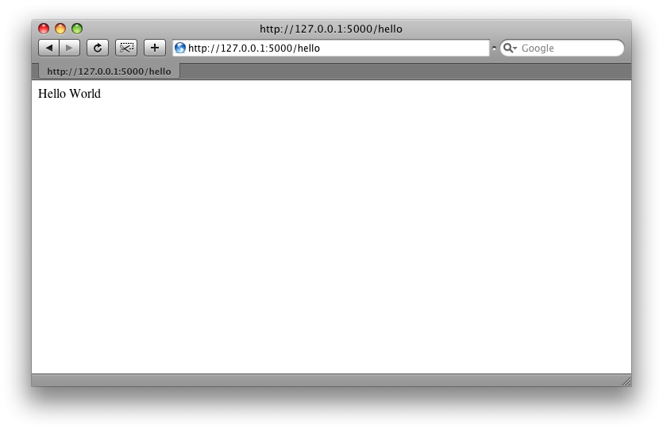
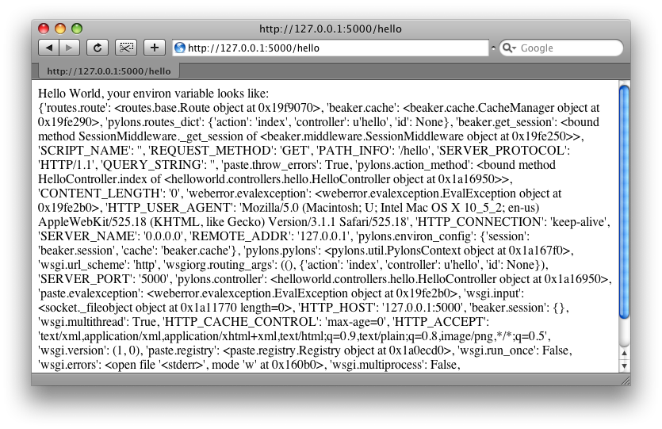

.. _getting-started:

Getting Started
===============

This section is intended to get you up and running with Pylons as fast as
possible, and provide a quick overview of a project. Links are provided
throughout to encourage your exploration of the various aspects of Pylons.

About
-----

Pylons is a MVC (Model-View-Controller) based approach to writing Python web
applications. While Pylons encourages and allows for a wide variety of popular
Python libraries, the documentation and recommendations by the Pylons 
developers covers 'best of breed' components chosen with the goal of
expressiveness, efficiency, and performance.

Created in 2005 by Ben Bangert and James Gardner, Pylons has since grown to
be one of the most popular Python web frameworks. 

Requirements
------------

* Python 2.3+ (Python 2.4+ highly recommended)

Installing
----------

.. warning::
    
    These instructions require Python 2.4+. For installing with
    Python 2.3, see :ref:`python2.3-installation`.

To avoid conflicts with system-installed Python libraries, Pylons comes with a
boot-strap Python script that sets up a `virtual environment <http://http://pypi.python.org/pypi/virtualenv>`_. Pylons will then be
installed under the virtual environment.

.. admonition:: By The Way
    
    virtualenv is a useful tool to create isolated Python environments. In 
    addition to isolating packages from possible system conflicts, it makes
    it easy to install Python libraries using `easy_install <http://peak.telecommunity.com/DevCenter/EasyInstall>`_ without dumping lots
    of packages into the system-wide Python.
    
    The other great benefit is that no root access is required since all
    modules are kept under a directory of your choosing. This makes it easy
    to setup a working Pylons install on shared hosting providers and other
    systems where you might not have system-wide access.

1. Download the `go-pylons.py <http://www.pylonshq.com/download/0.9.7/go-pylons.py>`_ script.
2. Run the script and specify a directory for the virtual environment to be created under:
    
    .. code-block:: bash
        
        $ python go-pylons.py mydevenv

.. admonition:: Tip
    
    The two steps can be combined on unix systems with curl using the
    following short-cut:
    
    .. code-block:: bash
    
        $ curl http://pylonshq.com/download/0.9.7/go-pylons.py | python - mydevenv
    
    To isolate further from additional system-wide Python libraries, run
    with the no site packages option:
    
    .. code-block:: bash
    
        $ python go-pylons.py --no-site-packages mydevenv

This will leave you with a functional virtualenv and Pylons installation.
Activate the virtual environment (scripts may also be run by specifying the
full path to the mydevenv/bin dir):

.. code-block:: bash

    $ source mydevenv/bin/activate

Or on Window to activate:

.. code-block:: text
    
    > mydevenv\bin\activate.bat

Creating a Pylons Project
-------------------------

Create a new project named ``helloworld`` with the following command:

.. code-block:: bash

    $ paster create -t pylons helloworld

.. note:: 
    
    Windows users must configure their ``PATH`` as described in :ref:`windows-notes`, otherwise they must specify the full path name to the ``paster`` command (including the virtual environment bin dir).

Running this will prompt you for two choices, whether or not to include 
:term:`SQLAlchemy` support, and which template language to use. Hit enter both times
to accept the defaults (no :term:`SQLAlchemy`, with Mako templating). 

The created directory structure with links to more information:

- helloworld
    - MANIFEST.in
    - README.txt
    - development.ini - :ref:`run-config`
    - docs
    - ez_setup.py
    - helloworld
        - __init__.py
        - config
            - environment.py - :ref:`environment-config`
            - middleware.py - :ref:`middleware-config`
            - routing.py - :ref:`url-config`
        - controllers - :ref:`controllers`
        - lib
            - app_globals.py - :term:`app_globals`
            - base.py
            - helpers.py - :ref:`helpers`
        - model - :ref:`models`
        - public
        - templates - :ref:`templates`
        - tests - :ref:`testing`
        - websetup.py - :ref:`run-config`
    - helloworld.egg-info
    - setup.cfg
    - setup.py - :ref:`setup-config`
    - test.ini

Running the application
-----------------------

We can now run the web application like this:

.. code-block:: bash

    $ cd helloworld
    $ paster serve --reload development.ini
    
The command loads our project server configuration file in :file:`development.ini` and serves the Pylons application.

.. note::
    
    The ``--reload`` option ensures that the server is automatically reloaded
    if you make any changes to Python files or the :file:`development.ini` 
    config file. This is very useful during development. To stop the server
    you can press :command:`Ctrl+c` or your platform's equivalent.

If you visit http://127.0.0.1:5000/ when the server is running you will see
the welcome page.

Hello World
-----------

To create the basic hello world application, we'll first create a
:term:`controller` in the project to handle requests:

.. code-block:: bash

    $ paster controller hello

If you open the :file:`helloworld/controllers/hello.py` module it created, you
can see that it will return just the string 'Hello World', and looks like
this::

    import logging

    from pylons import request, response, session
    from pylons import tmpl_context as c
    from pylons.controllers.util import abort, redirect_to, url_for

    from helloworld.lib.base import BaseController, render
    # import helloworld.model as model

    log = logging.getLogger(__name__)
    
    class HelloController(BaseController):

        def index(self):
            # Return a rendered template
            #   return render('/template.mako')
            # or, Return a response
            return 'Hello World'

At the top are some imports of common objects you will frequently want to use
in your controllers.

Then navigate to http://127.0.0.1:5000/hello, where you should be greeted by
short text saying "Hello World" like so (start up your app if needed):

.. admonition:: How'd that get to /hello?
    
    :ref:`url-config` explains how URL's get mapped to controllers and
    their methods.

Let's add a template to render some of the information thats in the 
:term:`environ` back out.

First, create a :file:`hello.mako` file in your :file:`helloworld/templates`
directory with the following contents:

.. code-block:: mako

    Hello World, your environ variable looks like:  
    
    ${request.environ}

You'll see that we're using the :term:`request` variable in our template to
get information about the current request. There are a variety of other
`template globals <modules/templating.html#template-globals>`_ available as
well.

Next, update the :file:`helloworld/controllers/hello.py` module so that the
index method is as follows::

    class HelloController(BaseController):

        def index(self):
            return render('/hello.mako')

Refreshing the page in the browser will now look similar to this:

That's it! You now know how to create new controllers, add templates, and
render them back to the browser.
