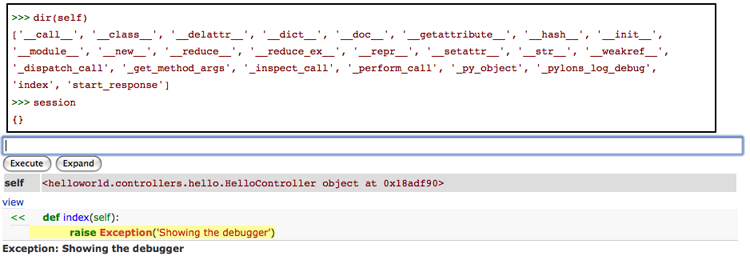

.. _debugging:

=================================
Вірішення проблем і відлагодження
=================================

.. _interactive_debugging:

Інтерактивне відлагодження
--------------------------

Предмети падінь, і коли вони виникають, швидке знаходження що пішло не так і чому виникають вличезні розбіжності. По замовчуванню, Pylons викорисовує дещо змінену версію `Ian Bicking <http://blog.ianbicking.org/>`_ EvalException middleware яке також включає і повну інформацію зворотнього трасування Mako/Myghty шаблонів. 

Сторінка відлагодження
----------------------

Сторінка відлагодження має вгорі три закладки: 

``Traceback`` 
Надає необроблений трейс виняткового стану з інтерактивним відлагоджувачем 

``Extra Data`` 
Відображає CGI, WSGI змінні в момент виняткової ситуації, як додаток до конфіґураційної інформації 

``Template`` 
Дружелюбне зворотнє трасування для шаблонів Mako або Myghty 

Оскільки Mako and Myghty транслюють свої шаблони в Python модулі, не завжди можливо точно визначити який рядок в шаблоні спричинив помилку. Закладка `Template` забезпечує повне Mako or Myghty зворотнє трасування, яке містить точні номери рядків вашого шаблону і інформацію де саме виникла помилка. Якщо винятковий стан виник до того як був виконаний ваш шаблон, ніякої доступної інформації в цій секції небуде. 

Приклад: Дослідження трасування 
------------------------------- 

Вискористовуючи інтерактивний відлагоджувач також дуже зручно глибше розуміти представлення обєктів лише за допомогою веб запитів, такими наприклад як є ``session`` або ``request`` об’єкти. 

Аби пробудити помилку щоб ми могли подивтись що сталось, лише породіть винятковий стан всередині action-а. В цьому прикладі, ми породимо помилку в action-і який використовується для того щоб відобразити сторінку яку ви зараз читаєте. Далі як цей контроллер виглядає: 

.. code-block:: python 

    class DocsController(BaseController): 
        def view(self, url): 
            if request.path_info.endswith('docs'): 
                redirect_to('/docs/') 
            return render('/docs/' + url) 

Оскільки ми хочем дослідити ``session`` і ``request``, ми повинні їх привязати. Далі наведено як наш Action буде виглядати: 

.. code-block:: python 

    def view(self, url): 
        raise "hi" 
        if request.path_info.endswith('docs'): 
            redirect_to('/docs/') 
        return render('/docs/' + url) 

Ось як буде виглядати зворотнє трасування нашого прикладу(уривок доцільної частини): 

Email Опції 
-----------

Ви можете вибирати як відлагодження буде працювати. Для прикладу, змінивши ``debug`` змінну в конфіґураційному файлі Pylons на ``false``, помилки не будуть відображатись на екрані, натомість Pylons відішле звіт помилки вам на email адресу, звісно якщо ви вкажите її в конфіґураційному файлі: 

.. code-block:: ini 

    error_email_from = you@example.com 

Це є дуже корисним для вже готового сайту. Листи відсилаються через SMTP, так шо вам буде потрібно вказати також і SMTP сервер. 

Опції обробки помилок 
===================== 

Певну кількість опцій для обробки помилок можна вказати в конфіґураційному файлі. Це все описується в розділі :ref:`interactive_debugging`, але одна важлива річ яку слід памятати, це те що відлагодження завжди повинне бути встановлено в ``false`` в готовому робочому середовищі, інакше якщо трапиться якась помилка, відвідувачу буде представлене інтерактивне зворотне трасування, яке він може використати для виконнання злоякісного коду.
