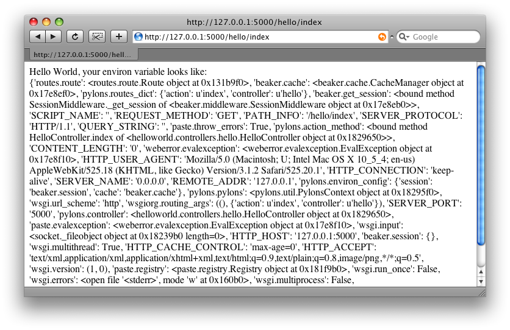

.. _getting_started:

=======
Початок
=======

Цей розділ призначений для того шоб ви могли отрмати і запустити Pylons якомога як найшвидше. І представляє короткий огляд проекту. В розділі наводяться посилання, для того шоб заохтити вивчення різних аспектів Pylons.

******
Вимоги
******

* Python 2.3+ (Python 2.4+ рекомендується вища версія)

************
Встановлення
************

.. warning::
    Ці інструкції вимагають Python 2.4+. Для встановлення на версію Python 2.3, див. :ref:`python23_installation`.

Для того, щоб уникнути конфліктів з встановленими в системі Python бібліотеками, Pylons поставляється з boot-strap Python скриптом, який встановлює `віртуальне середовище <http://pypi.python.org/pypi/virtualenv>`_. Потім Pylons буде встановлений в цьому віртуальному середовищі.

.. admonition:: До речі
    
   virtualenv є корисним інструментом для створення ізольованого середовища Python. Окрім ізоляції бібліотек від можливих конфліктів, він також надає можливість дуже легко встановлювати Python бібілотеки використовуючи `easy_install <http://peak.telecommunity.com/DevCenter/EasyInstall>`_ без встановлення цих всіх пакетів до загальносистемного Python середовища.
    
    Інша чудова можливість є те що не потрібен root доступ, оскільки всі модулі можуть зберігаються в любій директорії яку ви забажаєте. Це спрощує установку Pylons на на хостингу, або інших системах, де загальносистемний доступ недоступний.

1. Завантажте `go-pylons.py <http://www.pylonshq.com/download/0.9.7/go-pylons.py>`_ скрипт.
2. Запустіть скрипт і вкажіть директорію для віртуального середовища яке буде створене в даному каталозі:
    
    .. code-block:: bash
        
        $ python go-pylons.py mydevenv

.. admonition:: Підказка
    
     Ці два кроки можуть бути скомбіновані на unix системах з curl, використовуючи наступну команду:
    
    .. code-block:: bash
    
        $ curl http://pylonshq.com/download/0.9.7/go-pylons.py | python - mydevenv
    
    Щоб ізолювати середовище від загальносистемних бібліотек, вкажіть наступну опцію:
    
    .. code-block:: bash
    
        $ python go-pylons.py --no-site-packages mydevenv

Це зробить функціональним наше віртуальне середовище і усановку Pylons. Активуйте віртуальне середовише (скрипти можливо треба буде запускати вказуючи повний шлях до mydevenv/bin каталогу):

.. code-block:: bash

    $ source mydevenv/bin/activate

Або щоб активувати в Windows:

.. code-block:: text
    
    > mydevenv\Scripts\activate.bat

Робота з вихідним кодом 
=======================

Для того щоб отримати останню версію вихідного коду Pylons що перебуває у розробці потрібно встановити `Mercurial <http://www.selenic.com/mercurial/wiki/>`_. `Mercurial пакунки <http://www.selenic.com/mercurial/wiki/index.cgi/BinaryPackages>`_ є також доступні для Windows, MacOSX, і інших ОС.

Візьміть останній код: 

.. code-block:: bash 

    $ hg clone https://www.knowledgetap.com/hg/pylons-dev Pylons 

Для того, щоб повідомити setuptools використовувати версію в каталозі ``Pylons``: 

.. code-block:: bash 

    $ cd Pylons 
    $ python setup.py develop 

В даному каталозі тепер є активна версія Pylons, і всі зроблені там зміни, будуть впливати на роботу запущених Pylons програм.

************************
Створення проекту Pylons
************************

Створіть новий проект з ім'ям ``helloworld`` за допомогою такої команди:

.. code-block:: bash

    $ paster create -t pylons helloworld

.. note:: 
    
     Windows користувачі повинні сконфігурувати ``PATH`` як описано в :ref:`windows_notes`, інакше вони повинні будуть використовувати повний шлях до команди ``paster`` (включаючи bin каталог віртуального середовища).

Запуск даної команди вимагатиме зробити три вибори:

1. яку мову темплейтів використовувати
2. чи включати підтримку :term:`SQLAlchemy`

Натисніть enter біля кожного запиту шоб застосувати налашування по замовчуванню (Mako темплейти, без підтрикми :term:`SQLAlchemy`). 

Створена структура каталогів з посиланнями для більш детальної інформації:

- helloworld
    - MANIFEST.in
    - README.txt
    - development.ini - :ref:`run-config`
    - docs
    - ez_setup.py
    - helloworld (See nested :ref:`helloworld directory <helloworld_dir>`)
    - helloworld.egg-info
    - setup.cfg
    - setup.py - :ref:`setup-config`
    - test.ini

.. _helloworld_dir:

Каталог ``helloworld`` з вкладенями повинен виглядати на подобі цього:

- helloworld
    - __init__.py
    - config
        - environment.py - :ref:`environment-config`
        - middleware.py - :ref:`middleware-config`
        - routing.py - :ref:`url-config`
    - controllers - :ref:`controllers`
    - lib
        - app_globals.py - :term:`app_globals`
        - base.py
        - helpers.py - :ref:`helpers`
    - model - :ref:`models`
    - public
    - templates - :ref:`templates`
    - tests - :ref:`testing`
    - websetup.py - :ref:`run-config`

***************
Запуск програми
***************

Запустіть веб програму:

.. code-block:: bash

    $ cd helloworld
    $ paster serve --reload development.ini
    
Дана команда завантажує серверну конфігурацію вашого проекту з файлу :file:`development.ini` і запускає Pylons сервер.

.. note::
    
    Опція ``--reload`` гарантує що сервер буде автоматично перезавантажуватись кожного разу, якшо будуть зроблені зміни в ваших Pylons файлах або конфігураційному файлі :file:`development.ini`. Це дуже зручно під час розробки. Щоб зупинити сервер натисніть :command:`Ctrl+c` або відповідний еквівалент на вашій платформі.

Якщо ви зайдете на http://127.0.0.1:5000/ під час того як сервер буде запущений, ви побачите сторінку привітання.

***********
Hello World
***********

Щоб створити простеньку hello world програму, спочатку створіть в проекті
:term:`контроллер` аби обробляти запити:

.. code-block:: bash

    $ paster controller hello

Відкрийте модуль :file:`helloworld/controllers/hello.py` який був стврений попередньою командою. Наш контроллер буде повертати лише рядок ‘Hello World’:

.. code-block:: python

    import logging

    from pylons import request, response, session
    from pylons import tmpl_context as c
    from pylons.controllers.util import abort, redirect_to, url_for

    from helloworld.lib.base import BaseController, render
    # import helloworld.model as model

    log = logging.getLogger(__name__)
    
    class HelloController(BaseController):

        def index(self):
            # Return a rendered template
            #   return render('/template.mako')
            # or, Return a response
            return 'Hello World'

Зверху файла є імпортовані деякі загальні модулі, які часто використовуються в контроллерах.

Перейдіть до сторінки http://127.0.0.1:5000/hello/index де ви повинні побачити короткий текст - “Hello World” (не забудьте запустити сервер, якщо він не запущений):

.. image:: _static/helloworld.png

.. admonition:: Як ми отримали запит до /hello/index?
    
    :ref:`url-config` пояснює як підключити любу URL адресу до контроллера і його методів.

Додамо темплейт шоб за допмогою нього відобразити вміст :term:`environ`.

Спочатку створіть :file:`hello.mako` файл в папці :file:`templates`
з наступним вмістом:

.. code-block:: mako

    Hello World, the environ variable looks like:  
    
    ${request.environ}

Змінна :term:`request` в темплейтах використовується щоб отримати інформацію про поточний запит. `Template globals <modules/templating.html#template-globals>`_ містить список всіх змінних які Pylons робить доступними для того щоб використовувати в темплейтах.

Далі змініть :file:`controllers/hello.py` модуль, так щоб він виглядав так як подано нижче:

.. code-block:: python

    class HelloController(BaseController):

        def index(self):
            return render('/hello.mako')

Оновивши сторінку в вашому броузері, ви повинні побачити щось на подобі цього:

